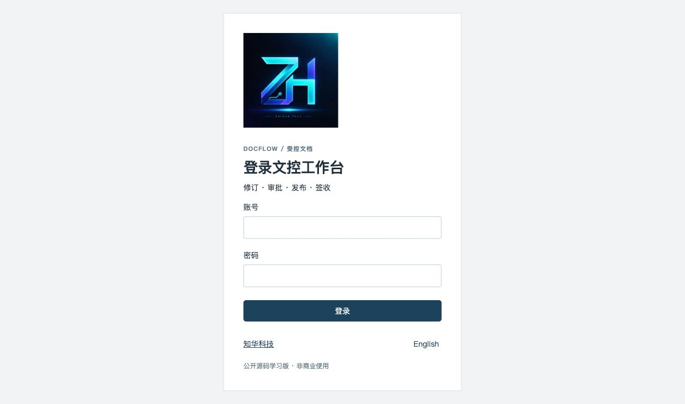
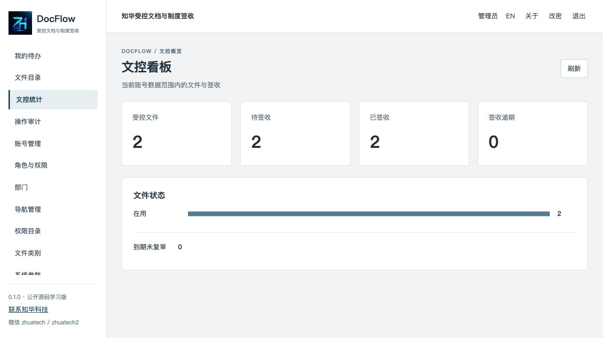
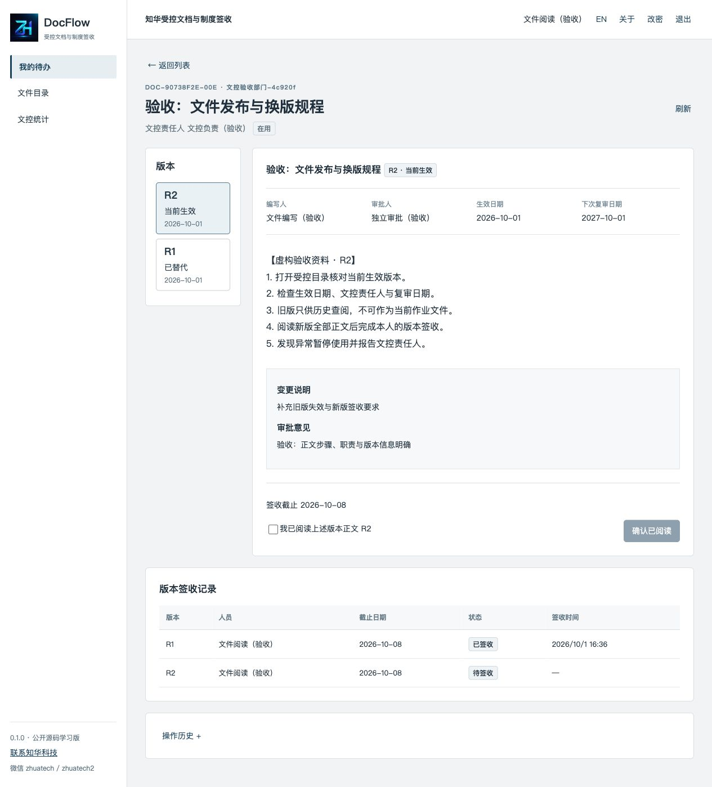
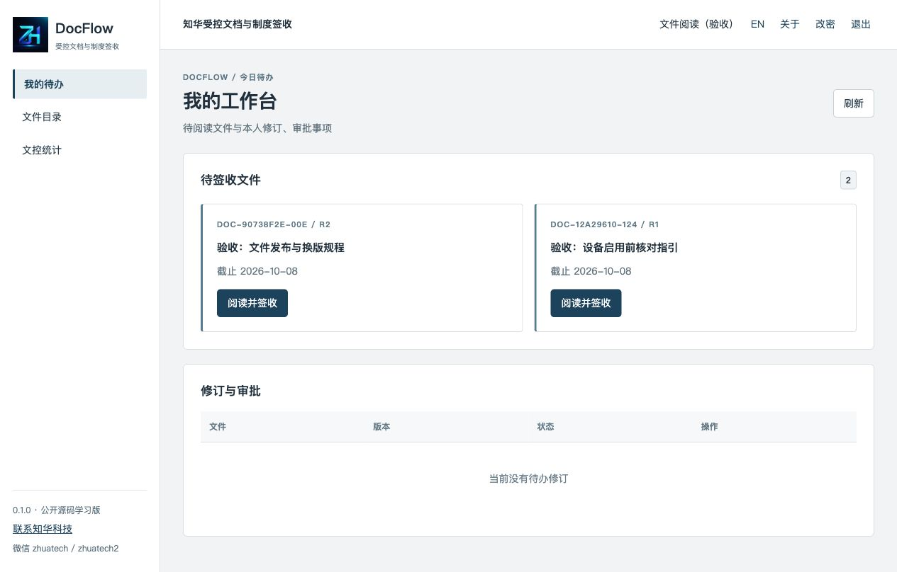
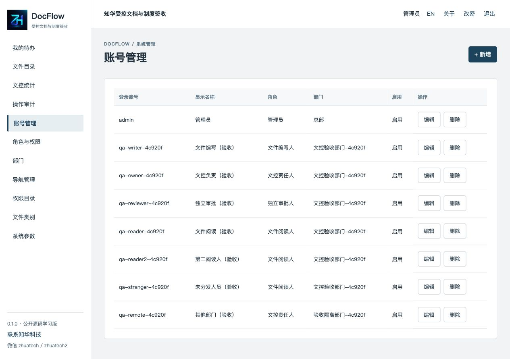
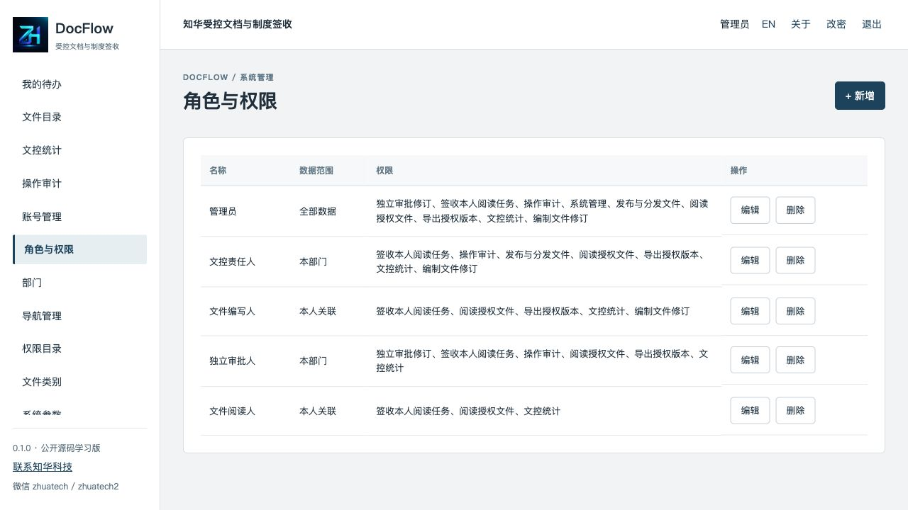

# DocFlow · 知华科技受控文档与制度签收公开源码学习版

上海如静知华信息科技有限公司 · [官网](https://www.zhuatech.cn/) · 商业咨询微信 **zhuatech / zhuatech2**

**0.1.0｜公开源码学习版／非商业源码版。未经书面授权不得商用。** 自有代码适用 [LICENSE](LICENSE)，限个人学习、研究及非商业测试；这不是 OSI 开源许可证。第三方依赖按各自许可证使用，品牌说明不改变授权范围。

## 业务定位

面向中小企业制度、SOP 和工作指引的文控流程：谁负责编写、谁独立审批、哪一版正在生效、谁已阅读、旧版如何保留。适合在隔离环境学习企业文控和权限实现，不声称满足 ISO、医药 GMP、电子签名或司法取证要求。

## 已实现

- 受控目录：类别、部门、文控责任人；编号由服务端生成，按名称或编号搜索、状态和类别筛选、分页和有限排序。
- 正文修订：纯文本正文、变更说明、独立审批人、生效日、下次复审日、签收截止日和接收人员。每个目录最多一份未完成修订。
- 独立审批：审批人与本版编写人、建档人、文控责任人不同；退回修改、撤回送审、批准后撤销修订均保留历史。
- 生效发布：仅目录责任人发布已批准版本，未到生效日不能发布；新版生效时替代旧版并取消旧版待签收任务，保留旧版正文和已签收证据。
- 分发签收：本人阅读当前版本后确认；服务端验证任务归属、当前版本和正文摘要，防止旧版误签与冒名签收。额外分发自动去重。
- 归档：关闭待签收任务，保留版本和历史；已送审或发布记录不能硬删除。
- 我的待办、文控统计、复审及签收逾期指标、版本事件、操作审计、授权范围内的 JSON 快照导出。
- 账号、角色权限、部门、菜单、类别字典和系统参数管理；ALL / DEPARTMENT / ASSIGNED 三种数据范围；中文与英文界面。
- 乐观版本号、目录行锁与命令幂等键共同防止陈旧覆盖和重复流转。

## 当前边界

不含附件上传、Office/PDF 在线预览、富文本、全文检索、目录树、跨部门共享、会签、委托审批、定时自动发布、通知、外部单点登录、AI 编写或语义检索。接收范围为同部门已启用且有阅读及签收权限的人员。账号停用或角色调整会即时限制操作，已发布正文保持不变；不会替换已签收证据或自动转派责任人。

签收代表账号提交了“已阅读”的声明，正文摘要是 SHA-256 校验值，不是电子签名，也不能证明阅读理解程度。日期到期只出现在统计中，不自动停用当前版本。统计和审计适合学习规模，未作大规模性能认证。

## 架构与版本

| 层 | 技术 |
| --- | --- |
| 后端 | Java 21、Spring Boot 4.0.7、Spring Security、JPA、Maven 3.9 |
| 前端 | Vue 3.5.40、Vite 8.1.5、Node.js 24.19.0、Nginx |
| 数据 | MySQL 8.4、Flyway V1/V2、MariaDB Connector/J 3.5.10 |
| 验收 | JUnit、MockMvc、H2 MySQL 模式、Node Test、真实 MySQL HTTP 流程 |
| 本地部署 | Docker Compose：mysql → backend → frontend 健康依赖 |

浏览器只调用同源 `/api`；Nginx 代理后端，无跨域令牌存储。数据库卷持久化数据，后端和数据库不映射主机端口。前后端容器使用非 root 用户。后端运行镜像沿用 Java 21 Maven 官方镜像，包含构建工具，体积较大。

## 快速启动

要求 Docker Engine / Docker Desktop 与 Compose v2，Python 3；本机源码运行需要 Java 21、Maven 3.9 和 Node.js ≥24.19.0。

```sh
python3 scripts/init-env.py
docker compose config --quiet
docker compose up -d --build --wait
```

访问 **http://127.0.0.1:8099/**，账号 **admin**，首次密码从本地忽略的 `.env` 中 `ADMIN_PASSWORD` 读取。初始化脚本生成独立强密码，拒绝覆盖已有 `.env`，不输出密码。首次启动只建立权限、菜单、字典、系统参数及管理员；不植入业务案例。

`.env.example` 仅列配置名。`ADMIN_PASSWORD` 只用于空库建立管理员，重启不会覆盖已修改密码。不要把 `.env`、运行日志、导出报告或客户数据提交。

端口被占用时：

```sh
WEB_PORT=8109 docker compose up -d --build --wait
```

| 环境变量 | 用途 |
| --- | --- |
| DATABASE_PASSWORD | 独立应用数据库密码，必填 |
| MYSQL_ROOT_PASSWORD | MySQL 初始化 root 密码，必填 |
| ADMIN_PASSWORD | 空库管理员初始密码，必填 |
| WEB_PORT | 前端端口，默认 8099 |
| BIND_ADDRESS | 主机绑定地址，默认 127.0.0.1 |
| COOKIE_SECURE | 本机 HTTP 为 false，HTTPS 部署设 true |

后端源码开发可以设置 `DATABASE_URL`、`DATABASE_USER`、`DATABASE_CATALOG`；Compose 固定到自身服务网络。详细见[部署与升级](docs/部署与升级.md)。

## 数据库与接口

数据库 `zhuatech_docflow`。完整 SQL 在 `backend/src/main/resources/db/migration/`：V1 建表、外键、约束与业务索引，V2 增加日期索引及菜单权限外键。Flyway 按版本迁移，JPA `validate` 校验，不依赖本机既有数据库；已应用的迁移不要改写。

核心表：`controlled_document`、`document_revision`、`revision_recipient`、`read_assignment`、`document_event`、`command_stamp`；管理表存放账号、角色、权限、菜单、部门、字典、参数和审计。见[架构与接口](docs/架构与接口.md)。

## 安全与部署

BCrypt cost 12；密码至少 12 位、含大写小写及数字且 UTF-8 编码不超过 72 字节。会话使用 HttpOnly / SameSite=Strict Cookie，30 分钟超时；所有修改要求 CSRF。角色权限和账号状态服务端逐次校验，密码变更使原会话无效。单实例登录失败限制不是分布式防护。

本地 MySQL 驱动设置 `sslMode=trust`，没有 CA 身份验证；正式环境须配置 `verify-full`、证书、HTTPS、安全 Cookie、备份恢复、监控、审计保留和外部密钥管理。学习版不提供生产合规保证。不对公网直接暴露当前 Compose。

## 检查命令

```sh
cd frontend
npm ci
npm run format:check
npm run lint
npm test
npm run build
cd ../backend
mvn -B spotless:check clean verify
cd ..
docker compose config --quiet
docker compose build
```

镜像构建不跳过测试。完整 MySQL 验收脚本只允许明确授权的本机测试部署：

```sh
python3 scripts/smoke.py --allow-test-data
python3 scripts/release-check.py
git diff --check
```

脚本会写入标明“验收”的虚构资料，不能在生产库运行。全新测试卷、检查项目、数量和结果见[测试与验收](docs/测试与验收.md)。停止本项目：`docker compose down`；删除数据必须自行确认后加 `--volumes`，不要清理其他项目。

## 实际运行页面

以下为隔离测试库的当前页面，业务资料明确标为虚构验收资料，不代表客户案例。

### 登录

### 文控统计

### 版本正文与签收

### 我的待办

### 账号管理

### 角色权限


## 文档

[操作手册](docs/操作手册.md) · [部署与升级](docs/部署与升级.md) · [架构与接口](docs/架构与接口.md) · [测试与验收](docs/测试与验收.md) · [第三方说明](docs/第三方说明.md)

## 联系知华科技

公司：**上海如静知华信息科技有限公司**。官网：**https://www.zhuatech.cn/**。商业授权、定制开发、私有化部署、系统集成、软件实施及技术支持咨询微信：**zhuatech / zhuatech2**。


